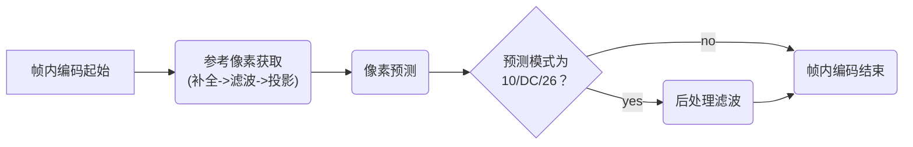

# 流程简介

## 1 概述

### 1.1 流程示意图

帧内编码的流程示意图如下

### 1.2 流程文字说明

HEVC 的帧内编码**以 TU 为基本单位**，主要分为三个步骤，分别为**参考像素获取**（reference sample array construction）、**像素预测**（sample prediction）以及**后处理滤波**（post-processing）

参考像素获取分为**参考像素补全**、**参考像素滤波**和**参考像素投影**三个部分，在参考像素获取阶段，我们首先**补全待预测 TB 左侧、左下侧、左上侧、上侧、右上侧的参考像素**，然后对参考像素进行**滤波**，最后**根据所选的帧内预测模式进行投影将二维参考像素变为一维序列**

在像素预测阶段，我们**依照所选模式通过一维参考像素序列对 TU 内像素值进行预测**

在后处理滤波阶段，**当采取 DC、10、26 模式时需要对预测完成的像素值中的边界像素进行滤波**

### 1.3 最佳帧内预测模式选择

HEVC 通过**最佳预测模式搜索**选择其使用的帧内编码模式，进行预测模式搜索时将对**部分或所有可选的帧内编码模式**（亮度分量可选的帧内预测模式多，选部分，色度分量可选的帧内预测模式少，选所有）执行上述步骤，计算**率失真**，选择**率失真最小**的编码模式