# DPF

## 1 介绍

### 1.1 概述

去方块滤波器（Deblocking Filter，DPF）是环路滤波阶段的第一个滤波器，用于去除方块效应。方块效应是由于**块与块之间的不连续性**而在恢复图像中产生的矩形状视觉瑕疵，典型示例如下图（图片截自[此 Youtube 视频](https://www.youtube.com/watch?v=PKXIwixuA_E)）

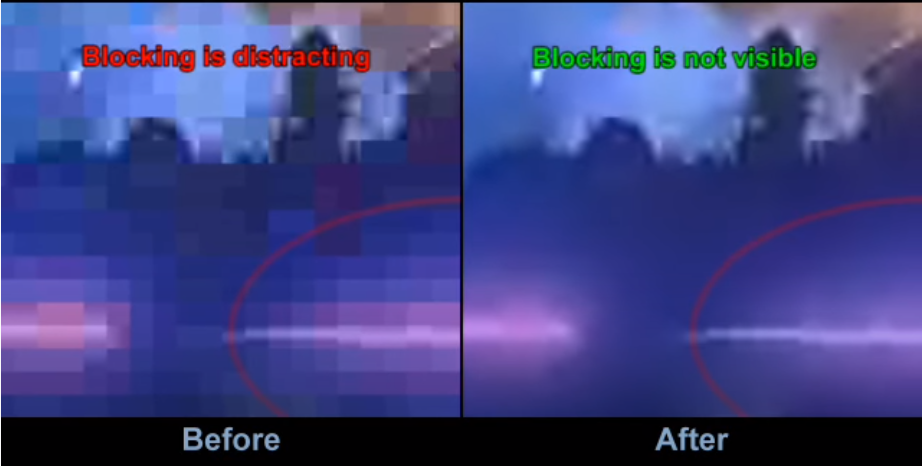

下图为块与块之间”不连续“的示意图

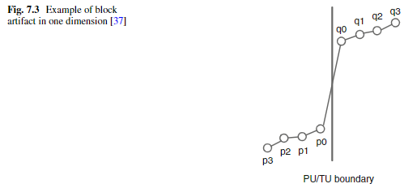

如上图的这种不连续性广泛存在于 **TU**（由于独立的变换量化）**和 PU**（由于不同的帧内编码模式或者帧间编码运动信息）**的边界**之间。在纹理丰富的区域，方块效应容易被人眼忽略，但是在颜色值的变化较为有限的平坦区域则不会。因此，**HEVC 的 DPF 主要对平坦、单值区域的 TU 和 PU 边界像素进行去方块滤波。**（也就是 $p_3 - p_0$ 的变化较小且 $q_0 - q_3$ 的变化也较小时进行滤波）

> 对纹理丰富区域使用 DPF 不仅效果不大而且可能会导致其被平滑

### 1.2 流程简介

去方块滤波主要分为四个步骤，分别为**获取边界**、**计算边界强度**（Boundary Strength，**Bs**）、**执行滤波决策**和最终**滤波**，流程图如下

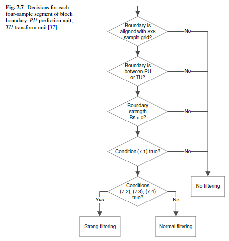

## 2 滤波过程

### 2.1 获取边界

去方块滤波只针对边界像素，因此需要先找到边界像素的所在。为了减小运算和便于并行，HEVC 只对 8x8 网格上的像素进行边界搜索，**若确定这些像素样本属于 PU 或者 TU 边界，则进入下一步骤判定边界强度，否则不进行滤波**。以一个 4x8 大小的 PU 为例，4 这条边界会被舍弃，8 这条边界会进入下一环节。

### 2.2 边界强度计算

边界强度计算主要用于下一步滤波决策判断是否需要滤波以及采用何种滤波类型，其可以视为方块效应的发生机率，**边界强度越大，则方块效应的发生机率越大。**边界强度的获取以及之后的滤波决策和滤波操作都是**以边界周围一对 4x4 小块为基本单位**，对于垂直边界而言，小块分布于边界左右两侧，对于水平边界而言，小块分布于边界上下两侧，如下图所示

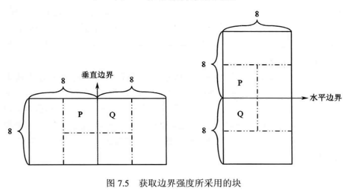

需要注意，边界强度计算以及之后的所有操作需要**对所有的小块组合进行**，也就是对于上图的这种情况，需要分别**计算两次边界强度，做两次滤波决策，计算两次滤波**，一次是对 P Q 小块，一次是对 P Q 下面（右侧）的小块

边界强度计算的规则如下

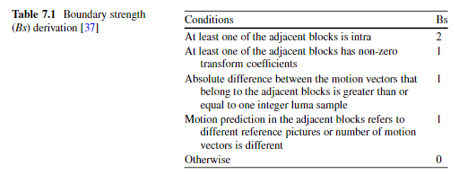

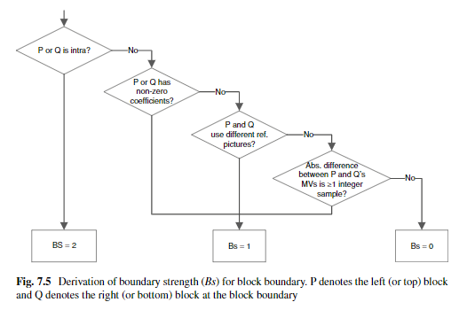

如果为亮度分量，**当边界强度大于 0 时进入下一步滤波决策**，如果为色度分量，**当边界强度大于 1 时直接进行滤波，否则不进行滤波**

### 2.3 滤波决策

#### 2.3.1 简介

滤波决策是**亮度分量**判断是否进行滤波的最后一环，如下图所示，将 4x4 小块水平分割为 line0 ~ line 3，滤波决策环节将根据边界 **line 0 和 line 3** （在虚线框起来的位置）**左右各三个**像素值决定**是否进行滤波**以及**是否进行强滤波**

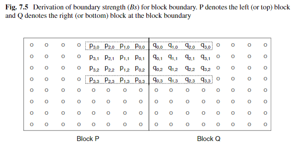

#### 2.3.2 滤波判决

决定是否滤波的条件如下

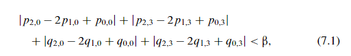

公式 7.1 中的四个二阶导的和在中文书中被称为**纹理度**，当纹理度较大，说明边界左右各自像素值变化较大，不需要滤波，如果纹理度较小，则说明**边界左侧像素值变化较小且边界右侧像素值变化也较小，属于两边都比较平坦的情况，需要滤波**

在英文书中这样解释这个公式，由于这个公式实际上算的是二阶导，二阶导小就说明边界两侧像素值的导数的变化小，可以看作导数近乎不变，而导数不变的情况只有两种，一种是边界两侧的像素值呈“斜面”状递增或递减，一种是边界两侧的像素值呈“平面”状几乎不变，需要滤波的就是这两种情况，其中“斜面”情况采取**普通滤波**，“平面”情况采取**强滤波**，见下节

$\beta$ 的选取由 $\beta'$ 确定，$\beta'$ 由下表通过 $QP_L$ 值确定

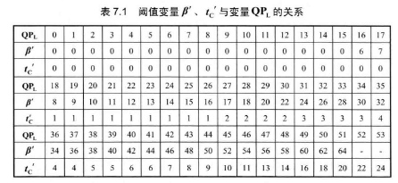

下图为上表中 $QP_L$ 与 $\beta'$ 关系的曲线表示形式

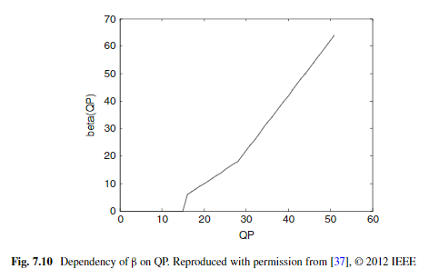

其中 $\beta'$ 与 $\beta$ 的关系如下，对于 8 位的比特深度来说，$\beta$ 就是 $\beta'$

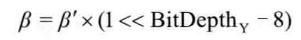

$QP_L$ 由 P Q 区块的量化参数 $QP$ 确定，关系式如下

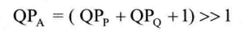

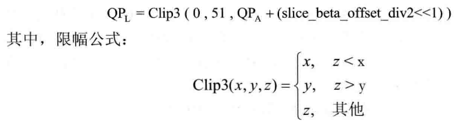

$QP_P$ 与 $QP_Q$ 为 PQ 两区块的 QP 值，有关 `slice_beta_offset_div2` 的说明见补充笔记

#### 2.3.3 强滤波判决

DPF 滤波器有两种滤波模式，一种是**普通滤波模式**（Normal Filtering Mode），一种是强滤波模式（Strong Filtering Mode），普通滤波模式适用于**边界两端像素点的亮度/色度强度分布类似“斜面“的情况（也就是逐渐上升或者逐渐下降）**，而**强滤波则适用于其分布类似“平面“的情况（也就是基本相同）**。

强滤波模式的判断条件如下，当 line 0 和 line 3 （也就是 $i=0,3$）均满足以下条件时，执行强滤波，否则执行普通滤波

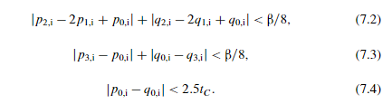

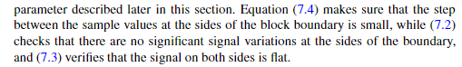

对上述公式的解释如下：

1. 公式 7.2 就是对 0/3 每条 line 单独执行一个更加严格的公式 7.1，实质为二阶导，**保证像素值变化的导数的导数足够小**
2. 公式 7.3 大致上是求一阶导的平均值，$|p_3-p_0|=|(p_3-p_2)+(p_2-p_1)+(p_1-p_0)|$，就是三个导数加起来，是不是除以三倒是无所谓，**保证像素值变化的导数的平均值足够小**
3. 公式 7.4 **保证边界两端的像素差值足够小**（如果差值过大说明差值可能是原图片边界处像素本身自然形成的，而不是方块效应所造成的）

公式 1 2 加起来就是让边界两端像素值的“变化”足够小，因此这三个公式的直观要求如下图

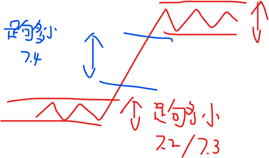

当满足这三个公式的要求时，像素值在边界两侧的值的分布接近“平面”，符合强滤波的适用要求

### 2.4 滤波

#### 2.4.1 普通滤波

首先依照如下公式确定需要滤波的点数

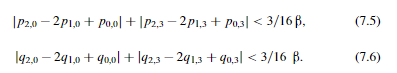

公式 7.5 决定了 P 区块需要滤波的点数，当公式 7.5 满足，P 区块每一条 line 靠近边界的**两个像素**会被滤波操作修改，否则靠近边界的**一个像素**会被修改

公式 7.6 决定了 Q 区块需要滤波的点数，当公式 7.6 满足，Q 区块每一条 line 靠近边界的**两个像素**会被滤波操作修改，否则靠近边界的**一个像素**会被修改

对于每一条 line，又有以下公式决定是否最终执行滤波

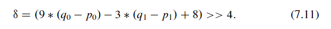

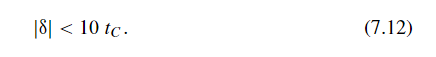

当 7.12 不满足，不滤波，当 7.12 满足，按照之前确定的滤波像素个数滤波，7.12 用于衡量边界处的差值是由于块效应产生还是自然形成的，与公式 7.4 类似，当 $\delta$ 过大，则认为其是自然产生的差值，因此不进行修正

$t_C$ 的值由 $t_C'$ 确定，$t_C'$ 则由 $QP_L$
  确定，对应表格见前面 $\beta'$ 和 $QP_L$ 的表格

$QP_L$ 获取的公式如下（注意与前面求 $\beta$ 时的 $QP_L$ 的公式存在区别，这里 $QP_L$ 的计算需要参考 $B_s$）

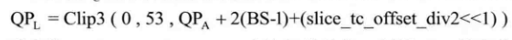

$QP_A$ 的公式与之前一致，有关 `slice_tc_offset_div2` 的说明见补充笔记

下图为前表格中 $QP_L$ 与 $t_C'$ 关系的曲线表示形式

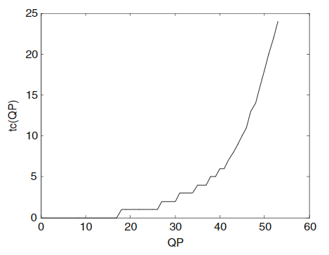

$t_C$ 与 $t_C'$ 的关系如下

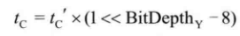

整个滤波点数决定流程的流程图如下

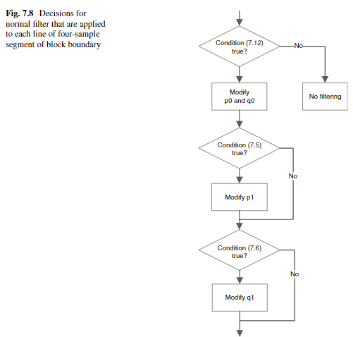

下面介绍滤波过程，普通滤波用于解决边界两侧**各自**像素接近斜坡的情况，其滤波目的是让**跨越边界两侧的所有像素合起来**也要接近斜坡，这样就接近了没有块效应时的情况（也就是**边界两侧像素变化连续**），其示意图如下

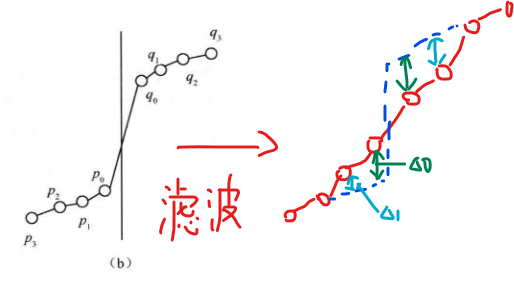

对于靠近边界的 $p_0$ 点将其加上 $\Delta0$，对于靠近边界的 $q_0$ 点将其减去 $\Delta0$，公式如下

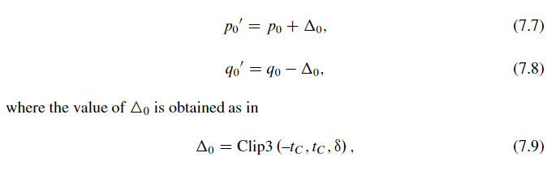

> clipping 的目的是防止滤波过度

当需要对边界附近两个像素滤波时，同时对靠近边界的 $p_1$ 点将其加上 $\Delta1$，对靠近边界的 $q_1$ 点将其减去 $\Delta1$，公式如下

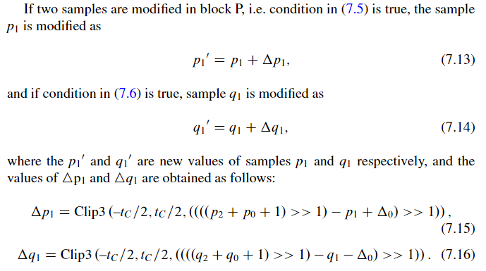

如果边界附近像素本身已经是一个完美的斜坡了（也就是 $q_1-q_0=q_0-p_0=p_0-p_1=\cdots$），那么 $\delta=0$，$\Delta0=\Delta1=0$，滤波操作不会对边界像素做出任何修改

#### 2.4.2 强滤波

强滤波用于边界两侧像素值变化“平坦”因而块效应更加明显的情况，如下图

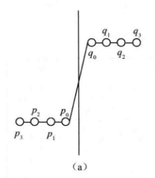

强滤波将修改边界两边各**三个像素**的值，同时还会启用强低通滤波，其滤波过程如下（以 P Block 的边界像素为例）

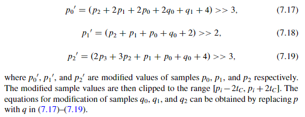

对于 Q Block 的边界像素也一样，将上述公式的 p q 互换即可

#### 2.4.3 色度分量的滤波

色度分量在判断完边界强度之后若 $B_s=2$ 就会直接进行滤波，不会再进行其它判断操作，其只对边界两侧各**一个像素**进行滤波，滤波公式如下

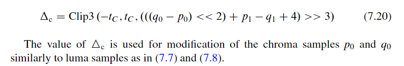

$q_0$ 减去 $\Delta_C$，$p_0$ 加上 $\Delta_C$
，$t_C$ 同样由色度分量的 $QP_L$ 通过查前面的表得到，色度分量的 $QP_L$ 称为 $QP_{ch}$，$QP_{ch}$ 的公式如下

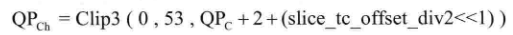

其中 $QP_C$ 由 $QP_i$ 通过查表得到

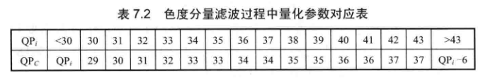

$QP_i$ 由 $QP_A$ 通过以下公式得到，$QP_A$ 就是 P Q 两个区块 QP 的平均值，公式与之前计算亮度 $QP_L$ 值时出现的 $QP_A$ 相同

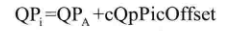

`cQpPicOffset` 是一个通过 PPS 传输的参数

## 3 补充笔记

### 3.1 滤波范围/强度与量化参数的关系

根据前面的 $t_C$ 和 $\beta$ 与 $QP_L$ 的关系可知，**量化参数越大**，则 $t_C$ 和 $\beta$ 越大，滤波决策的条件越宽松，**滤波范围/强度越大**。由于量化参数决定了量化步长，量化步长越大，图片中的像素值被量化至更加有限的值之中，恢复图像的质量会更差，方块效应更加明显，因此需要范围更广、幅度更强的去方块滤波。当量化参数减小，滤波的范围/强度也逐渐减小，**当量化参数低于某个阈值时 $t_C$ 和 $\beta$ 先后变为零**，此时恢复图像的质量本身已经足够好，因此不再需要去方块滤波（可能此时加了反而会让质量变差）

### 3.2 滤波范围/强度的动态调整

在给定量化参数 QP 时，代表滤波范围/强度的 $t_C$ 和 $\beta$ 值依旧可以通过参数 `slice_beta_offset_div2` 和 `slice_tc_offset_div2` 来进行调整，这两个参数在 slice header 或者 PPS 层次上指定，在通过查表用 $QP_L$ 计算 $t_C'$ 或者 $\beta'$ 的过程中，$QP_L$ 会在原来的基础上**加上两倍的以上参数**（这个过程已经体现在之前的计算 $QP_L$ 的公式之中），这两个参数给予了编码器根据当前的编码状态自适应地调整 DPF 的范围和强度的能力

使用举例：在包含水流、烟、火、雨、雪等元素的视频中，由于这些元素包含较多的无序运动，因此使用 QP cascading 时会在高 level 层产生较严重的方块效应，此时可以使用 `tc_offset_div2` 和 `beta_offset_div2` 参数在高 level 的图片上增强去方块滤波效果来提高视觉质量

### 3.3 QP cascading

一种用于层次化参考结构的在保证质量的情况下压缩码流的技术，当编码 GOP 的参考结构如下所示时（Random Access Profile 就是这种结构），可以对图片 $I_0$ 使用 base QP，对 level 0 层次的其它图片使用 QP+1，对 level 1 层次的图片使用 QP+2，对 level 2 层次的图片使用 QP+3，如此**逐层增大 QP**，由于高层图片不会被别的图片参考，因此**其失真不会传递给其它图片**，可以用更大的 QP 压缩码流，而底层图片会被其它同层次或者更高层的图片参考，当前图片的失真会传递到参考此图片的其它图片中造成后者失真的增大（**失真会随着参考关系链式扩散**），因此采用更小的 QP 增强图片质量（减小失真）

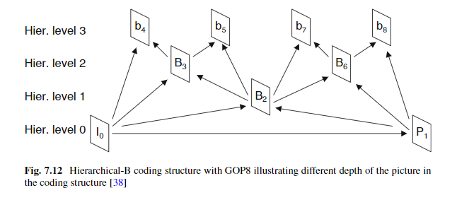