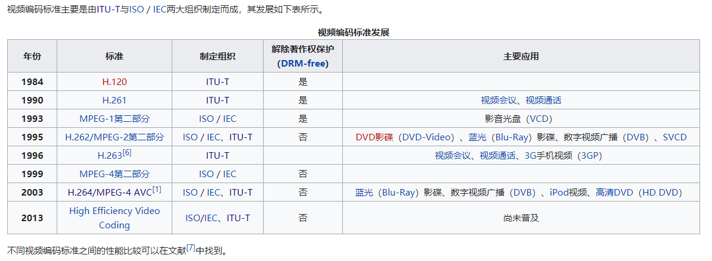

# HEVC

## 1. 简介

### 1.1 HEVC 编码标准

HEVC 全称 High Efficiency Video Coding，中文名为高效率视频编码，是目前广泛使用的一种视频编码标准，也被称为 H.265，在 **2013 年** 正式启用（成为国际标准）。在 HEVC 之前流行的视频编码标准是 **H.264 标准（又称为 MPEG-4 AVC）**，在 HEVC 之后将要推广的视频编码标准是 **H.266 标准（又称为 VVC，此标准于 2020 年 7 月 6 日确定）**

H.264 维基百科: [[网址](https://zh.wikipedia.org/wiki/H.264/MPEG-4_AVC)]

H.265 维基百科: [[网址](https://zh.wikipedia.org/wiki/高效率视频编码)]

H.266 维基百科: [[网址](https://zh.wikipedia.org/wiki/多功能视频编码)]

### 1.2 制定组织

HEVC 由来自 ISO/IEC 的 MPEG 小组和来自 ITU-T 的 VCEG 小组共同组成的 **JCT-VC 小组**制定

**国际电信联盟 (ITU)** 主要负责确定国际无线电和电信的管理标准，为联合国 15 个专门机构之一，其下属的**电信标准化部门 (ITU-T)** 为 ITU 提出的国际标准的主要制定者，电信标准化部门 (ITU-T) 下属的**视频编码专家组 (ITU-T VCEG)** 参与了多个视频编码协议的制定，包括 H.261，H.263，H.264，H.265 等

**国际标准化组织 (ISO)** 是主要负责制定国际工商业标准的非政府组织，其与同属非政府组织的**国际电工委员会 (IEC)** 合作密切，后者主要负责电子电工相关行业的标准制定。ISO 与 IEC 共同成立的**动态影像专家小组 (MPEG)** 参与了 MPEG 系列视频标准的制定，包括 MPEG-1，MPEG-2，MPEG-4 等

### 1.3 复杂度

HEVC 以**编解码复杂度提升**为代价实现了相对 H.264 的更大压缩性能，**在相同画质下码率能够降低 50%**

于此相同，H.266 同样以编解码复杂度提升为代价实现了相对 HEVC 的压缩性能提升 (压缩率提升 30%~50%) ，有观点认为，以上方法的性能提升**本质上是计算机计算性能的提升**，即摩尔定律在视频编码领域的体现，更多的晶体管数量意味着更强的计算能力，更强的计算能力意味着可以支持更加复杂的编解码方法，而更加复杂的编解码方法带来了更大的压缩率提升。**视频编码方案的不断演进似乎是以摩尔定律的永不实效为前提的**，如果摩尔定律走到极限，**如何在给定的复杂度下继续优化降低视频码率**，可能将会成为视频编码发展的一个主要方向。

### 1.4 资源

HEVC 的官方网站：[[地址](https://hevc.hhi.fraunhofer.de/)]

从中可以得到以下资源：

- HEVC 的官方开源编解码器 HM（HEVC Test Model）：[[地址](https://vcgit.hhi.fraunhofer.de/jct-vc/HM)]
- ITU-T H.265 官方文档：[[地址](https://www.itu.int/rec/T-REC-H.265)]
- HEVC 通用测试环境（指用来测试编解码效果的程序配置和视频序列）说明：[[地址](http://phenix.it-sudparis.eu/jct/doc_end_user/documents/12_Geneva/wg11/JCTVC-L1100-v1.zip)])

其它有用资源有：

- HEVC 通用测试环境中的视频序列下载：[[地址](https://blog.csdn.net/abcSunl/article/details/53841953)]
- 码流分析软件 Elecard HEVC Analyzer 下载：[[地址](https://www.0daydown.com/10/446234.html)]
- 开源 YUV 视频查看器 YUView 下载：[[地址](https://github.com/IENT/YUView)]
- 参考论文：[[Overview of the High Efficiency Video Coding(HEVC) Standard](http://iphome.hhi.de/wiegand/assets/pdfs/2012_12_IEEE-HEVC-Overview.pdf)]
- 参考书籍：新一代高效视频编码H.265HEVC原理、标准与实现 [万帅，杨付正 编著] 2014年版
- 参考书籍：High Efficiency Video Coding (HEVC): Algorithms and Architectures

其它版本视频编解码方案的相关资源有：

- H.264 的官方开源编解码器 JM（Joint Model）：[[地址](http://iphome.hhi.de/suehring/tml/download/)]
- H.266（VVC）的官方网站：[[地址](https://jvet.hhi.fraunhofer.de/)]
- H.266 的官方开源编解码器 VTM（VVC Test Model）：[[地址](https://vcgit.hhi.fraunhofer.de/jvet/VVCSoftware_VTM)]

## 2. 补充笔记

### 2.1 视频编码

**视频编码**就是**视频压缩**，进行视频编码的原因有二

1. 视频需要压缩，未经压缩的视频**体积过大**

    以 [此网站](https://juejin.im/post/6844904000194625550) 所举的例子为例，分辨率 1920x1080，帧率 30 的真彩色视频，如果不经过压缩，**每秒大小为 186.6MB，90 分钟视频大小将达到 984GB**，接近 1TB 量级

2. 视频能够压缩，视频中的图片存在**空间冗余性**和**时间冗余性**

    空间冗余性是指，视频中的单张图片中不同空间区域存在相似性，**可以只传输此图片的某一块区域，将其复制得到此图片的其它区域**

    时间冗余性是指，视频中的多张图片中不同空间区域存在相似性，因此同样**可以只传输某一图片的某一块区域，将其复制得到其它图片其它区域**

    在使用 HEVC 提供的官方编解码器 HM 的编码部分进行的实验中，只利用空间冗余性可以达到 **30~90 倍**的压缩率，同时利用空间冗余性和时间冗余性可以达到 **800~1200 倍**的压缩率，**一部 2.89 GB 原始格式（YUV 420）视频可以被压缩成 3.3MB**

### 2.2 发展历程

视频编码标准的发展示意图如下（图片来源 [维基百科](https://zh.wikipedia.org/wiki/視訊壓縮)）

