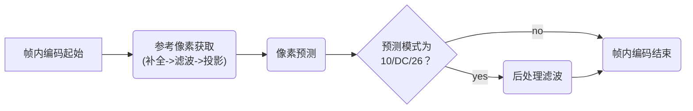

# 流程简介

## 1 概述

### 1.1 流程示意图

帧内编码的流程示意图如下

### 1.2 流程文字说明

HEVC 的帧内编码**以 TU 为基本单位**，主要分为三个步骤，分别为**参考像素获取**（reference sample array construction）、**像素预测**（sample prediction）以及**后处理滤波**（post-processing）

参考像素获取分为**参考像素补全**、**参考像素滤波**和**参考像素投影**三个部分，在参考像素获取阶段，我们首先**补全待预测 TB 左侧、左下侧、左上侧、上侧、右上侧的参考像素**，然后对参考像素进行**滤波**，最后**根据所选的帧内预测模式进行投影将二维参考像素变为一维序列**

在像素预测阶段，我们**依照所选模式通过一维参考像素序列对 TU 内像素值进行预测**

在后处理滤波阶段，**当采取 DC、10、26 模式时需要对预测完成的像素值中的边界像素进行滤波**

### 1.3 单个 PU 的最佳帧内模式选择

前面以及该段之后会介绍的是在已给定帧内预测模式的情况下，帧内预测的流程，这里简要介绍下帧内预测模式的选择的过程，x265 的帧内预测模式选择基本是按照这个流程进行的。

帧内模式选择以 PU 为基本单位，对于单个 PU，帧内模式的选择一般分为**粗选**、**细选**和**确定最佳 TU 划分**三个阶段。选择使用**率失真损失** $J = D + \lambda R$ 确定最佳模式，因为完整的率失真损失需要经过变换量化才能获知准确的失真和码率，过于耗时，因此有时也会使用残差的哈达玛变换近似上述的**失真加码率**的结果，也就是 **satd cost**。

粗选阶段，遍历 35 个预测模式，使用 satd cost 选出若干**候选模式**，细选阶段，对候选模式进行完整的变换量化（但是固定 TU 划分），使用完整的率失真损失选出候选模式中的**最佳模式**，最后对该最佳模式启用允许递归进行 TU 划分的变换量化过程，选择出该**最佳模式的最佳 TU 划分**，以上便完成了单个 PU 的最佳帧内模式选择。