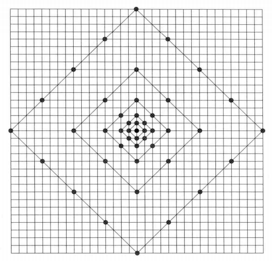

# AMVP 模式

## 1 概述

### 1.1 简介

AMVP 是帧间预测中运动估计的另一个方法，相比于 Merge 模式增加了 **MV 搜索**的过程，**其获得的运动信息更加准确，但是也因此需要显式地对 MVD 等信息进行编码**，当 `merge_flag` 为 0 时默认启用 AMVP

## 2 MV 预测

### 2.1 运动向量候选

AMVP 允许**两个运动向量预测候选**，从这两个候选中选择率失真最小的 MV **作为 MV 搜索过程的起点**。运动向量候选将从**五个空域位置**和**一个时域位置**中产生，如下图，这些位置与 Merge 模式中的情况相同

### 2.2 空域候选

#### 2.2.1 选择流程示意图

AMVP 先尝试选出两个空域候选，如果没有，才进行时域候选的选择。空域候选选择的规则如下

#### 2.2.2 A 候选选择步骤

A 候选选择的步骤如下：

1. 判断 A0 和 A1 位置的运动向量是否可用（不可用的条件为该 PU 采用**帧内编码**或者该 PU **在当前 PU 所在的 slice 或 tile 之外**）
2. 检验 A0 和 A1 其**参考的图片是否与当前 PU 参考的图片相同**，若相同，则称之为 **non-scaled 区块**，否则称为 **scaled 区块**。
3. 按照 $\{non\_scaled\ A_0,\ non\_scaled\ A_1,scaled\ A_0,\ scaled\ A_1\}$ 的顺序选择第一个可用的区块，如果该区块为 non-scaled 区块，那么其 MV **直接**作为候选 A 的 MV，如果该区块为 scaled 区块，那么其 MV 在**经过 scale 之后**作为候选 A 的 MV

这一步只选出一个 MV 候选

> Merge 模式下当前帧的参考帧一定与被 Merge 的邻域块的参考帧相同（除了 TMVP），而 AMVP 模式下，当前块的参考帧**可以与邻域块不同**，因此有时需要额外的 MV 缩放操作

#### 2.2.3 Β 候选选择步骤

B 候选选择的步骤如下：

1. 判断 B0，B1 和 B2 位置的运动向量是否可用
2. 判断候选 A 有没有值（也就是 A0 和 A1 是否都不可用）
3. 检验 B0，B1 和 B2 其参考的图片是否与当前 PU 参考的图片相同，若相同，则称之为 non-scaled 区块，否则称为 scaled 区块。
4. **若 A 没有值**，按照 $\{non\_scaled\ B_0,\ non\_scaled\ B_1,\ non\_scaled\ B_2,\ scaled\ B_0,\ scaled\ B_1\,\ scaled\ B_2\}$的顺序选择**前两个**可用的区块经过对应处理后作为**候选 A 和候选 B** 的 MV
5. **若 A 有值**，按照 $\{non\_scaled\ B_0,\ non\_scaled\ B_1,\ non\_scaled\ B_2\}$ 的顺序选择**第一个**可用的区块作为**候选 B** 的 MV

这一步可以选出一个或两个 MV 候选

#### 2.2.4 Scale 操作

这里对运动向量的 scale 操作类似于 Merge 模式里面对时域候选的 MV 的 scale 操作。其意义在于，如果当前 PU 和参考 PU 都是参考的同一张图片，那么两者的**运动时间是一样的**，因此被两个 PU 各自所覆盖的物体部分相比于各自的参考图片的**运动距离可以近似相等**（默认速度一致），因此运动向量不需要 scale（运动向量就是这个运动距离）。而如果当前 PU 和参考 PU 参考的是不同的图片，那么两者的**运动时间是不同的**，因此被两个 PU 各自所覆盖的物体部分相比于各自的参考图片的**运动距离并不相等，拿参考 PU 的运动距离无法作为当前 PU 的运动距离**，因此运动向量需要进行 scale，以去除时间不同的影响。

Scale 的公式同 [Merge 模式] 中时域候选一节里面的 Scale 公式相同，只不过 td 变为**候选区块的参考图片**与**当前区块和候选区块共同所在的图片**的时间距离（时域候选情况下候选区块是在同位图片里的，不是当前图片里的）

### 2.3 时域候选

当两个空域候选没有满时启用时域候选，具体选择规则同 Merge 模式

### 2.4 额外候选

当空域候选和时域候选加起来依旧没有达到候选列表的长度（2 个候选）时，采用**零运动向量**作为额外候选填满候选列表

## 3 MV 搜索

### 3.1 简介

MV 搜索的搜索算法分为**全搜索算法**和**快速搜索算法**，全搜索算法对搜索窗内所有可能的位置计算匹配误差，得到**全局最优 MV**，快速搜索算法不搜索所有位置，得到**局部最优 MV**，快速搜索算法包括**二维对数搜索算法**、**三步搜索算法**以及 HM 中使用的 **TZSearch 算法**，HEVC 标准没有限制采取什么搜索算法（因为这个是编码端的事情，不会影响解码端）

### 3.2 TZSearch

TZSearch 的代码见 HM 中的 **`TEncSearch::xTZSearch`** 函数，其操作流程如下

1. 搜素起始点为当前待预测区块通过 AMVP 的 MV 预测步骤找到的 MVP 进行反向位移得到的区域

    

    > 它这里是一个点，可能是覆盖的区域上取一个点表示这个区域，反正后面计算 MV 时候的位移可以看作是点到点之间的位移，也可以看作是区域到区域之间的位移

2. 按照如下图正方形或菱形模板**从中心到外端**搜索完整个范围，选取**率失真代价最小**的点的与当前区块对应点的相对位移作为最优 MV（步长从 1 开始，按照 2 的幂次递增）

    菱形模板如下

    

    正方形模板如下（这两个模板似乎搜索的点是一样的，只不过搜索的顺序不一样？有些点在正方形模板是步长等于 1 的时候搜索到，但是在菱形模板是步长等于 2 的时候搜索到？）

    

    > 顺时针还是逆时针？

3. 若最优点**步长为 1**，则进行**两点搜索，搜索尚未搜索的点中离最优点最近的两个点**，示意图如下

    

    如最优点为 2，则搜 a，b（黑点上面有字！），若最优点为 6，则搜 e，g，几个黑点周围的点都被搜索过了

4. 若最优点步长**大于某个阈值**，则以该最优点为中心，在一定范围内做**全搜索**，找到此范围内的最优点
5. 以更新后的最优点为中心重复 2-4，若最后找到的最优点还是这一点则停止搜索，若不是则继续以更新后的最优点为中心重复 2-4 直到两次搜索收敛于相同的最优点