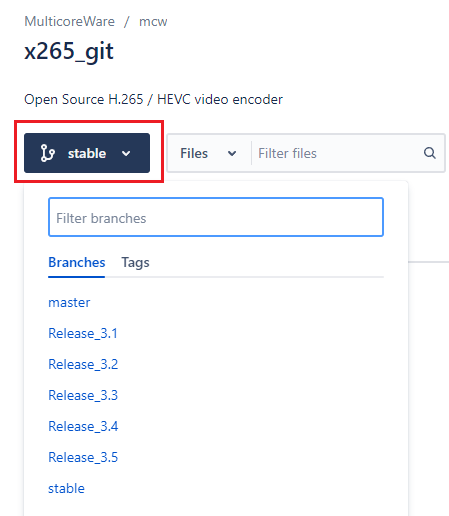
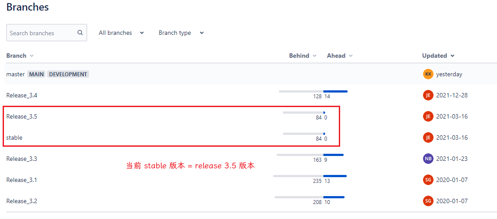
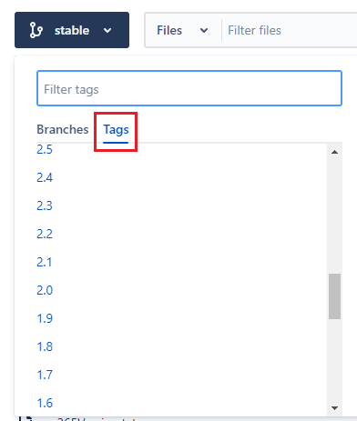
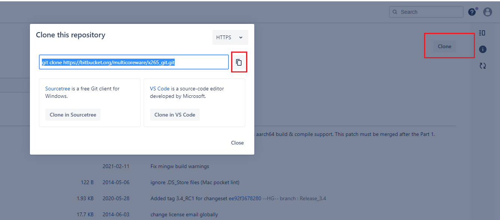
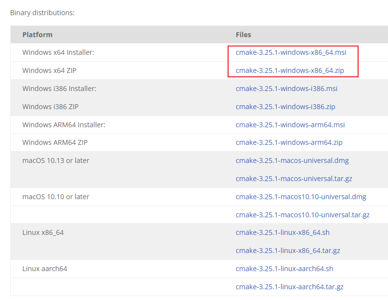
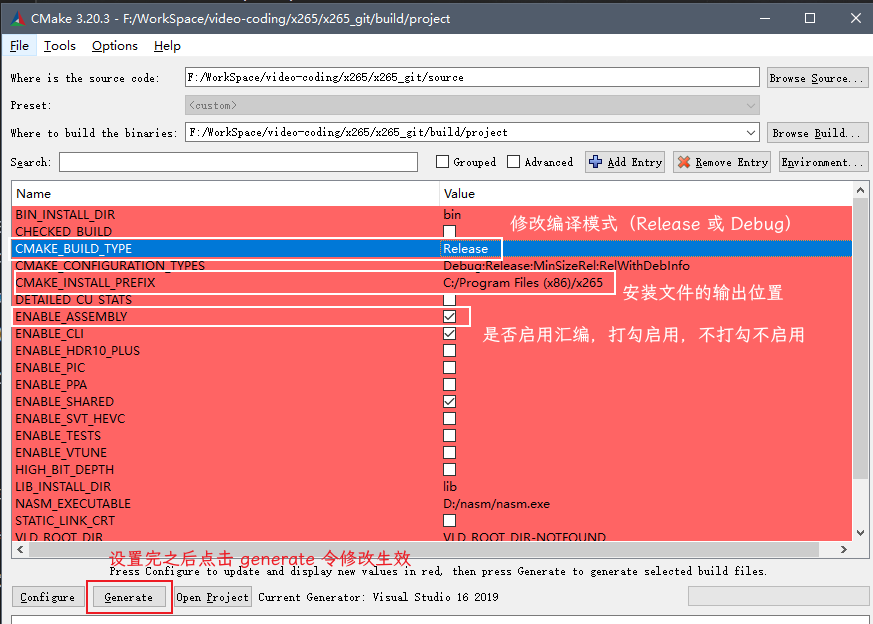
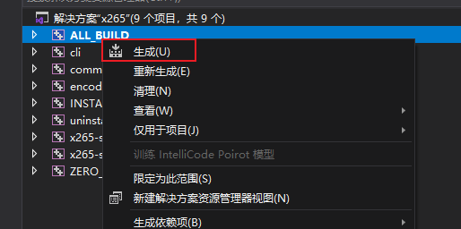
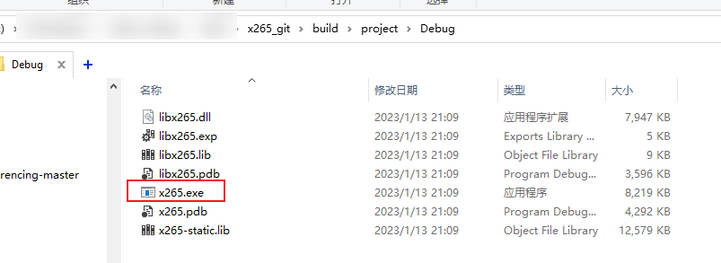

# x265 介绍与编译流程

## 1 x265 基本介绍

一句话介绍：x265 是一个**快速**、**性能较优**、**使用广泛**，**符合 HEVC 标准**，**开源**的**视频编码器**

* **快速**：快速是针对官方的 HEVC 开源编码器 [HM](https://vcgit.hhi.fraunhofer.de/jvet/HM) 而言的，在相近配置下，x265 的编码速度可以较 HM 有数十上百倍的提升（如下图，截自[论文[x265_HM_CQP]](https://ieeexplore.ieee.org/abstract/document/8901356)）。这是由于相较 HM，x265 使用了多种的加速算法，包括不限于多线程加速、提前终止、汇编加速。x265 不同的预设参数配置（preset）对应了不同的加速等级，从 `ultrafast`​到 `veryslow`​，而即使是 `veryslow`​ 等级，其速度也比 HM 有显著的提升。

  ​​

  注：x265 还有一个更慢的 `placebo`​​（安慰剂）等级，但是一般不用，这个速度比 `veryslow`​​ 慢很多，但是性能没提多少（见 [该网站测试结果](https://magiclen.org/x265-preset/)）
* **性能较优**：快速是 x265 的重要优势，与此同时，**x265 还保持着不错的性能**。2015 年的 MSU 视频编码器大赛是第一届**有 HEVC 标准编码器参赛**的 MSU 比赛（之前基本都是 H264 的编码器参赛），在该竞赛中 x265 击败了所有的竞争对手获得了综合性能第一的成绩（见下图，MSU 大赛结果报告可从[该网站]()获取），说明了当时 x265 的性能是优于其它的实时性的编码器的。不过 x265 和 HM 的性能还是有一定差距，比如 [论文[x265_HM_CQP]](https://ieeexplore.ieee.org/abstract/document/8901356) 的结果表明性能差距在 25% 左右，而另一篇[论文[x265_HM_BestParam]](https://www.cambridge.org/core/journals/apsipa-transactions-on-signal-and-information-processing/article/comprehensive-video-codec-comparison/C1BEFBC1983E06BE4D67B239AC0F26A4) 的结果表明性能差距在 15% 左右，差别在于前者 x265 是在 CQP 下测试的，后者是在 CRF 下测试的（CRF 下 x265 会开启 cutree，这个能提升十个点以上增益）。

  ​

  注：该图截自 2015 MSU 大赛结果报告
* **使用广泛**：因为**快速**且**性能较优**，x265 成为了目前工业界使用最为广泛的开源 HEVC 编码器，常用作企业进行自有编码器研发的**参考**和**对比对象**，比如[腾讯](https://cloud.tencent.com/developer/article/1507719)、[阿里](https://mp.weixin.qq.com/s/7M4-viHiEH47L1PlYgqEjw)、[网易](https://mp.weixin.qq.com/s/SpmYBzFNkqsTeyd222nfpA)在介绍自己的自研编码器时，都普遍是拿 x265 来作为 anchor 的，这也是对 x265 本身影响力的一种肯定。对于个人用户来说，x265 也是常见的影片编码器，如下图很多 HEVC 编码的电影都是拿 x265 压缩的，所以在网上的影片资源中，很多也都带有 x265 的名字。在学术界，HM（现在基本都是 VTM 了）广泛被作为研究对象，而在学术界之外的地方，x264/x265 则是更加常用的视频编码器

  ​

  注：该图截自[此网站](https://zhongce.sina.com.cn/article/view/19275/)
* **符合 HEVC 标准**：x265 只能编码输出符合 HEVC 标准的码流（废话），如果要编码 H.264，可以左转 [x264](https://code.videolan.org/videolan/x264/-/tree/master)，如果要编码 VVC，可以右转 [vvenc](https://github.com/fraunhoferhhi/vvenc)
* **开源**：x265 遵循 [GNU GPL](https://www.gnu.org/licenses/old-licenses/gpl-2.0.html) 协议开源，我们可以在网络上获取 x265 的完整代码。关于获取 x265 代码的方法在后面会提到
* **视频编码器**：对，这也是一个特点，有些初学者（比如我）一开始会以为 x265 同时也是一个解码器，但其实不是的，x265 只能编码视频，不能解码视频，通常研究时候还需要配合一个解码器使用，比如 [ffmpeg](https://ffmpeg.org/) 就是常用的解码器

## 2 x265 相关资源介绍

* x265 代码下载

  * 官方代码仓库：[https://bitbucket.org/multicoreware/x265_git/src/stable/](https://bitbucket.org/multicoreware/x265_git/src/stable/)（最新）
  * github 镜像：[https://github.com/videolan/x265/commits/master](https://github.com/videolan/x265/commits/master)（不是最新）
  * 官方 ftp：[http://ftp.videolan.org/pub/videolan/x265/](http://ftp.videolan.org/pub/videolan/x265/)（不是最新）
* x265 官方文档（英文）：[https://x265.readthedocs.io/en/master/](https://x265.readthedocs.io/en/master/)（没找到中文的，应该没有，建议学英语）
* x265 的各文件代码注释：[https://blog.csdn.net/cabbage2008/category_6077644.html](https://blog.csdn.net/cabbage2008/category_6077644.html)
* x265 代码解读博客合集：[https://blog.csdn.net/maryhaocoolcool/article/details/114356468](https://blog.csdn.net/maryhaocoolcool/article/details/114356468)
* 其它 H265 相关资源可访问：[https://zllz4.github.io/HEVC-notes/#/./docs/HEVC/CP1_HEVC/HEVC?id=_14-%e8%b5%84%e6%ba%90](https://zllz4.github.io/HEVC-notes/#/./docs/HEVC/CP1_HEVC/HEVC?id=_14-%e8%b5%84%e6%ba%90)

## 3 x265 的编译流程

以下主要介绍在 windows 环境下编译 x265 的流程，在 windows 环境下，x265 有两种编译方式，一种是在安装了 VS(Visual Studio) 的情况下，使用 VS 中的 MSVC 编译环境进行编译，另一种是在安装了 msys2 的情况下，使用 msys2 中的 gcc 进行编译，使用第一种还是第二种，个人感觉主要看你是否想用 VS 来作为修改 x265 代码的 IDE。以下对两种方法分别进行介绍。

### 3.1 代码下载

编译前首先需要下载 x265 代码，如果你不需要下载最新版本，可以去 github 镜像下载，目前最新的是 2020 年的 [3.4 版本](https://github.com/videolan/x265/releases/tag/3.4)，如果你需要最新的版本，或者对镜像不放心，那么可以从官方的 bitbucket 仓库下载，不过这里需要一些 git 的相关操作，以下介绍从官方仓库下载的方法

1. 安装 git：因为下载 x265 代码需要用到 `git clone`​​，所以在下载前需要首先安装 git 软件，可以参考 [该网站](https://www.cnblogs.com/ay2021/p/15023636.html) 或者其它教程进行安装
2. 访问前面提到的 [x265 代码存储网站](https://bitbucket.org/multicoreware/x265_git/src/stable/)，选择合适的 x265 版本，**这一步主要是明确你想要的版本的名字，后面要用到**（Branches 名或者 Tags 名）

    我们可以通过下图的按钮进行分支切换，查看不同版本的 x265 代码

    ​​

    其中 **stable 版本 = 最新的 Release 版本**，比如现在（2023/1）stable 版本就对应的 Release 3.5 版本，**一般没有特殊情况建议下载 stable 版本**，当然你也可以下载 master 版本，但是 master 版本是还在开发中的版本，可能会有 bug。比如 22 年 10 月的时候 x265 新增了一个 mcstf（基于运动补偿的时域滤波）在 master 版本里，但是这个 mcstf 因为刚实现，存在 bug，不能开多线程，一开多线程就 segmentfault，所以一般还是建议下载 stable 的版本，这个是已经稳定的版本，基本不会有前面这种 bug。

    ​​

    如果要 3.0 之前的版本，可以到在 tag 里面去找

    ​​
3. 选择合适的 x265 版本后，使用 git 指令进行下载和版本切换

    首先点击右上角的 clone 获取下载指令，通过指令右边的复制按钮进行复制

    ​​

    然后在 git bash 里面通过 clone 指令进行下载（如果嫌慢，可以看下[怎么设置 git 的代理](https://www.cnblogs.com/xueweihan/p/7242577.html)，当然前提是你要有一个代理）

    ```shell
    name@DESK MINGW64 /f/WorkSpace/video-coding/x265
    $ git clone https://bitbucket.org/multicoreware/x265_git.git
    Cloning into 'x265_git'...
    remote: Enumerating objects: 89608, done.
    remote: Counting objects: 100% (89608/89608), done.
    remote: Compressing objects: 100% (89458/89458), done.
    remote: Total 89608 (delta 9097), reused 80262 (delta 111), pack-reused 0
    Receiving objects: 100% (89608/89608), 236.67 MiB | 11.05 MiB/s, done.
    Resolving deltas: 100% (9097/9097), done.
    ```

    需要注意的是，此时下载的程序默认的当前分支是 master branch，也就是如果现在进行编译，编译的代码是 master 版本的代码，如果要编译 stable 版本的代码，需要通过 `git checkout stable`​ 指令进行分支切换

    ```shell
    name@DESK MINGW64 /f/WorkSpace/video-coding/x265 # 列出文件名
    $ ls
    x265_git/

    name@DESK MINGW64 /f/WorkSpace/video-coding/x265 # 进入文件夹
    $ cd x265_git/

    name@DESK MINGW64 /f/WorkSpace/video-coding/x265/x265_git (master) # 默认激活的是 master branch
    $ git checkout stable # 进行分支切换
    Switched to a new branch 'stable'
    Branch 'stable' set up to track remote branch 'stable' from 'origin'.

    name@DESK MINGW64 /f/WorkSpace/video-coding/x265/x265_git (stable) # 切换成功，现在是 stable 分支
    ```

    如果你要转到别的 branch，或者 tag，也可以通过 `git checkout branch/tag名`​ 实现，这也是之前需要你明确你想要的版本名的原因

    比如下面的指令可以切换到 2.0 版本的代码

    ```shell
    name@DESK MINGW64 /f/WorkSpace/video-coding/x265/x265_git (stable)
    $ git checkout 2.0
    Note: switching to '2.0'.

    You are in 'detached HEAD' state. You can look around, make experimental
    changes and commit them, and you can discard any commits you make in this
    state without impacting any branches by switching back to a branch.

    name@DESK MINGW64 /f/WorkSpace/video-coding/x265/x265_git ((2.0))
    $
    ```

    这里会有个 'detached HEAD' state 的警告，不过不用管它，因为之后会创建新的 branch，所以这个警告不会有影响。（偏题警告：如果你好奇这个警告，可以看[该网站](https://blog.51cto.com/u_2982693/3354791)的说明，它实际上就是在提示你你目前不处于任何一个 branch，而 commit 是应该提交在 branch 上的，所以你现在处于一个某种意义上类似“只读”的状态，你可以提交，但是提交的这个 commit 因为不属于现存的任何一个 branch，所以是游离的，很难被追踪、操作，解决方法就是新开一个 branch）
4. (可选）如果你不打算修改 x265 的代码，或者不打算使用 git 进行版本管理，那么这条不用做，如果你打算使用 git 进行修改代码的版本管理，建议新开一个 branch 存放你的修改，方便对你的修改进行单独管理。过程也很简单，使用 `git branch 新branch名`​ 就可以

    ```shell
    name@DESK MINGW64 /f/WorkSpace/video-coding/x265/x265_git (stable)
    $ git branch my_work # 从 stable branch 新建 my_work branch

    name@DESK MINGW64 /f/WorkSpace/video-coding/x265/x265_git (stable)
    $ git checkout my_work # 切换到 my_work branch
    Switched to branch 'my_work'

    name@DESK MINGW64 /f/WorkSpace/video-coding/x265/x265_git (my_work) # 你现在处于 my_work branch 了，可以开始工作了
    ```

    通过 vscode 的 git graph 插件对 branch 进行可视化，也可以看到目前在 stable branch 中另起了一个新 branch

    ​​

### 3.2 通过 Visual Studio 编译

通过 VS 编译 x265 的方法主要通过以下步骤实现：

1. 安装 nasm，这一汇编器用于将 x265 的汇编代码转为二进制机器语言
2. 安装 cmake，用于 sln 文件生成
3. 通过 cmake 生成 sln 文件，sln 是 VS 的项目解决方案文件，生成 sln 文件后，才能通过 VS 对 x265 项目进行处理
4. 用 VS 打开 sln 文件，然后完成编译

#### 3.2.1 nasm 安装

1. 在[这一网址](https://www.nasm.us/pub/nasm/stable/win64/)可以找到 stable 版本的 nasm 安装程序，有洁癖的下载 zip 解压，没有洁癖的下载 exe 安装
2. 将 nasm 的安装路径加到 path 里（不会加看[这里](https://learn.microsoft.com/zh-cn/previous-versions/office/developer/sharepoint-2010/ee537574(v=office.14))）

#### 3.2.2 cmake 安装

1. 去 [cmake 官网](https://cmake.org/download/)选择合适的版本

    一般是选 x86_64 的，没有洁癖就用 msi 让它帮你装，安装时候会自动帮你设置 PATH，有洁癖就下载 zip 然后解压到指定位置，然后手动设置 PATH，效果都一样

    ​
2. cmake msi 安装时的选项可以看[这里](https://blog.csdn.net/qq_41895190/article/details/89299988)

#### 3.2.3 sln 文件生成

1. 检查你的 VS 版本

    这里主要看大版本，也就是你装的是 2017、2019 还是 2022，这个看 VS 的文件名就能看出来

    ​​
2. 找到对应版本的 cmake 的 generator 指令

    到[该网站](https://cmake.org/cmake/help/latest/manual/cmake-generators.7.html#id14)找到 Visual Studio Generators 小节，然后点击你的 VS 版本，比如我这里是点击 VS 2019 的版本，输出如下

    ​

    说明我这里 cmake 的 generator 指令是

    ```shell
    cmake -G "Visual Studio 16 2019" # -A 不加貌似也可以
    ```
3. 设定完整的 cmake 指令

    cmake 主要需要设置 -G、-S、-B 三个参数

    其中 -G 代表了**面向的编译环境**，这里称为 generator，前面已经设好了

    -S 代表了你**要编译的代码文件夹**，这里就是 x265_git 里面的 source 文件夹，为什么是这个文件夹？因为可以在里面看到一个 CMakeLists.txt，说明这个文件夹就是 cmake 操作的目标

    ​

    -B 是你**编译的结果的存储文件夹**，你可以随便设，这里是新建了一个 x265_git/build/project 文件夹存储结果

    因此，假设你在 x265_git 目录，那么完整的 cmake 指令就是

    ```shell
    cmake -G "Visual Studio 16 2019" -S ./source -B ./build/project
    ```

    以下是 cmake 文档对上述三个参数的说明（复制自[此网站](https://cmake.org/cmake/help/latest/manual/cmake.1.html#generate-a-project-buildsystem)）

    ```shell
    -S <path-to-source>
    Path to root directory of the CMake project to build.

    -B <path-to-build>
    Path to directory which CMake will use as the root of build directory.

    If the directory doesn't already exist CMake will make it.

    -G <generator-name>
    Specify a build system generator.

    CMake may support multiple native build systems on certain platforms. A generator is responsible for generating a particular build system. Possible generator names are specified in the cmake-generators(7) manual.

    If not specified, CMake checks the CMAKE_GENERATOR environment variable and otherwise falls back to a builtin default selection.
    ```
4. 运行指令，注意这里应该新开一个 git bash 运行，因为前面将 nasm 加入 path 后老的 git bash 是没有更新的，只有关掉新开一个才会更新

    ```shell
    89638@DESKTOP-GH9FGFJ MINGW64 /f/WorkSpace/video-coding/x265/x265_git (my_work)
    $ cmake -G "Visual Studio 16 2019" -S ./source -B ./build/project

    ... 前面一堆输出省略

    -- Found nasm: D:/nasm/nasm.exe (found version "2.16.01")
    -- Found Nasm 2.16.01 to build assembly primitives
    -- GIT_EXECUTABLE D:/Git/mingw64/bin/git.exe
    -- GIT LIVE REPO VERSION RETRIEVED
    -- X265 RELEASE VERSION 3.5+1-ce882936d
    -- The ASM_NASM compiler identification is NASM
    -- Found assembler: D:/nasm/nasm.exe
    -- Looking for strtok_r
    -- Looking for strtok_r - not found
    -- Looking for include file getopt.h
    -- Looking for include file getopt.h - not found
    -- Configuring done
    -- Generating done
    -- Build files have been written to: F:/WorkSpace/video-coding/x265/x265_git/build/project
    ```

    **注意** `Found Nasm 2.16.01 to build assembly primitives`​ 这句，如果是 not found，那么说明前面 nasm 安装可能有问题，比如加入 path 没成功，或者 git bash 没重启，需要检查

    如果最后输出跟上述输出一致，那么可以认为 cmake 运行成功，可以进行第二步 vs 的编译操作了
5. （可选）你可以通过 cmake-gui 调整编译的配置参数，语法是 `cmake-gui <path_to_build_project>`​（就是前面 -B 的参数值）

    比如我这个例子，就是

    ```shell
    cmake-gui ./build/project/
    ```

    在 GUI 模式下显示了编译的配置参数，你可以方便对其修改，比如**修改编译模式**、修改程序的安装位置（注意这个是安装的位置不是编译结果的输出位置，vs 怎么安装还不清楚）、**修改是否启用汇编**等等，在修改完成后点击 generate 令修改生效

    ​

    GUI 界面关闭后，你可以再次输入跟之前一样的 cmake-gui 指令检查之前修改是否生效，或者进行新的修改

#### 3.2.4 x265 编译

1. 打开刚在生成的 sln 文件，在这次编译中地址是 `x265_git\build\project\x265.sln`​
2. 在 **ALL_BUILD** 解决方案处右键-生成

    ​​
3. 编译成功

    如果看到以下输出，代表编译成功

    ```shell
    7>已成功生成。
    7>    0 个警告
    7>    0 个错误
    7>
    7>已用时间 00:00:00.19
    ========== 生成: 成功 7 个，失败 0 个，最新 0 个，跳过 0 个 ==========
    ```

    在 sln 文件的目录下可以有名为 Debug 或者 Release 的文件夹，其中可以找到生成的 exe 文件

    ​

    测试运行成功

    ​​

### 3.3 通过 msys2 进行编译

通过 msys2 编译的主要流程是

1. 安装 msys2 环境
2. 通过 cmake 生成 gcc 的 makefile
3. 进行编译

#### 3.3.1 安装 msys2 环境

1. 安装 msys2：[这里](https://zllz4.github.io/HEVC-notes/#/./docs/x264/x264_%E7%BC%96%E8%AF%91%E4%BD%BF%E7%94%A8/x264_%E5%AE%89%E8%A3%85%E4%B8%8E_hello_world?id=_212-%e5%ae%89%e8%a3%85%e6%ad%a5%e9%aa%a4)写过了，看 2.1.2 小节
2. 安装配套环境：[这里](https://zllz4.github.io/HEVC-notes/#/./docs/x264/x264_%E7%BC%96%E8%AF%91%E4%BD%BF%E7%94%A8/x264_%E5%AE%89%E8%A3%85%E4%B8%8E_hello_world?id=_22-mingw64-%e7%ad%89%e7%8e%af%e5%a2%83%e5%ae%89%e8%a3%85)写过了，看 2.2 小节
3. 这里需要额外再装一个 msys2 版本的 cmake，因为后面也需要 cmake 操作，而且需要在 msys2 终端里面执行

    ```shell
    pacman -S mingw-w64-x86_64-cmake
    ```

#### 3.3.2 makefile 生成

1. 设置 cmake 的 -G、-S、-B 三个参数

    这个前面在讲 VS 编译的时候已经提过了，可以看下前面的 3.2.3 小节的第 3 步

    -G 代表了**面向的编译环境**，这里称为 generator，在[这里](https://cmake.org/cmake/help/latest/manual/cmake-generators.7.html#id7)可以看到针对各个环境的 -G 参数，对于 msys2 来说，就是 "MSYS Makefiles"

    -S 代表了你**要编译的代码文件夹**，这里就是 x265_git 里面的 source 文件夹

    -B 是你**编译的结果的存储文件夹**，你可以随便设，本次编译设置的就是 x265_git/build/project2 文件夹

    因此，假设你在 x265_git 目录，那么完整的 cmake 指令就是

    ```shell
    cmake -G "MSYS Makefiles" -S ./source -B ./build/project2
    ```
2. 运行指令，**打开一个 msys2 终端，将你的工作目录定位到 x265_git 目录**，然后运行前面的 cmake 指令

    ```shell
    89638@DESKTOP-GH9FGFJ MINGW64 /f/WorkSpace/video-coding/x265/x265_git
    $ cmake -G "MSYS Makefiles" -S ./source -B ./build/project2

    ... 前面一堆输出省略

    -- Found nasm: D:/msys64/usr/bin/nasm.exe (found version "2.15.05")
    -- Found Nasm 2.15.05 to build assembly primitives
    -- GIT_EXECUTABLE D:/msys64/usr/bin/git.exe
    -- GIT LIVE REPO VERSION RETRIEVED
    -- X265 RELEASE VERSION 3.5+1-ce882936d
    -- The ASM_NASM compiler identification is NASM
    -- Found assembler: D:/msys64/usr/bin/nasm.exe
    -- Looking for strtok_r
    -- Looking for strtok_r - found
    -- Looking for include file getopt.h
    -- Looking for include file getopt.h - found
    -- Configuring done
    -- Generating done
    -- Build files have been written to: F:/WorkSpace/video-coding/x265/x265_git/build/project2

    89638@DESKTOP-GH9FGFJ MINGW64 /f/WorkSpace/video-coding/x265/x265_git
    ```

    **注意** `Found Nasm 2.15.05 to build assembly primitives`​ 这句，如果是 not found，那么说明前面 nasm 安装可能有问题，需要检查

    如果最后输出跟上述输出一致，那么可以认为 cmake 运行成功，可以进行第二步 gcc 的编译操作了
3. （可选）你可以通过 cmake-gui 调整编译的配置参数，语法是 `cmake-gui <path_to_build_project>`​（就是前面 -B 的参数值）

    见前面 3.2.3 小节的第 5 步，**不过注意 msys2 例子的目录是 project2 不是 project**

#### 3.3.3 x265 编译

1. 进入编译项目文件夹，这里是 `x265_git\build\project2`​
2. 输入 `make`​，这个指令的功能就是根据 makefile 的设置调用编译器进行编译
3. 编译成功

    如果看到如下输出，那么表示编译成功

    ```shell
    [ 80%] Building CXX object common/CMakeFiles/common.dir/deblock.cpp.obj
    [ 82%] Building CXX object common/CMakeFiles/common.dir/scaler.cpp.obj
    [ 82%] Built target common
    Scanning dependencies of target x265-static
    [ 83%] Linking CXX static library libx265.a
    [ 83%] Built target x265-static
    Scanning dependencies of target cli
    [ 84%] Building CXX object CMakeFiles/cli.dir/input/input.cpp.obj
    [ 85%] Building CXX object CMakeFiles/cli.dir/input/y4m.cpp.obj
    [ 86%] Building CXX object CMakeFiles/cli.dir/input/yuv.cpp.obj
    [ 87%] Building CXX object CMakeFiles/cli.dir/output/output.cpp.obj
    [ 88%] Building CXX object CMakeFiles/cli.dir/output/raw.cpp.obj
    [ 89%] Building CXX object CMakeFiles/cli.dir/output/reconplay.cpp.obj
    [ 91%] Building CXX object CMakeFiles/cli.dir/output/y4m.cpp.obj
    [ 92%] Building CXX object CMakeFiles/cli.dir/output/yuv.cpp.obj
    [ 93%] Building RC object CMakeFiles/cli.dir/x265.rc.obj
    [ 94%] Building CXX object CMakeFiles/cli.dir/x265.cpp.obj
    [ 95%] Building CXX object CMakeFiles/cli.dir/x265cli.cpp.obj
    [ 96%] Building CXX object CMakeFiles/cli.dir/abrEncApp.cpp.obj
    [ 97%] Linking CXX executable x265.exe
    [ 97%] Built target cli
    Scanning dependencies of target x265-shared
    [ 98%] Building RC object CMakeFiles/x265-shared.dir/x265.rc.obj
    [100%] Linking CXX shared library libx265.dll
    [100%] Built target x265-shared
    ```

    你可以在编译项目文件夹（project2 文件夹）中找到 x265.exe

    ​

    测试运行成功

    ​​

‍
