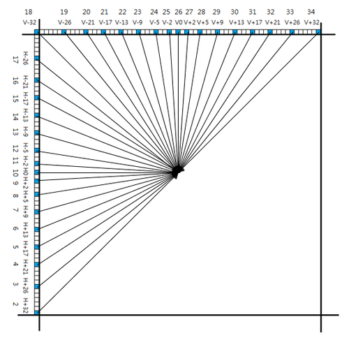

# 帧内编码模式

帧内编码时，**在 PU 层次选择帧内预测模式**，**在 TU 层次进行帧内编码**，对于**亮度 PB 区块**，其帧内预测有 **35 种模式**，包括 **33 种角度模式**和 **Planar 模式**以及 **DC 模式**，其中 Planar 模式编号为 0，DC 模式编号为 1，其余的角度模式编号为 2~34，角度模式用于**像素具有纹理变化**的区块，Planar 模式适用于**像素颜色缓慢变化**的区块，DC 模式用于**像素颜色大面积平坦**的区块，角度模式编号与方向关系如下图

由图可见，角度模式编号**按顺时针方向增加**，**越靠近垂直和水平方向越密**，其精度为 \\( \frac{1}{32} \\)，值得注意的两个模式是 **10 模式 (水平模式)** 和 **26 模式（垂直模式）**

不同的角度模式有不同的**角度参数 A**（就是图上 V 和 H 减的那个数），其与模式之间的关系表格如下

不同帧内预测模式直观效果展示如下（图中 DC 和 10、26 模式经过了后处理滤波）

对于**色度 PB 区块**，有五种预测模式，分别为 **Planar 模式**（模式 0）、**DC 模式**（模式 1）、**水平模式**（模式 10）、**垂直模式**（模式 26）和**推断模式**（Derive Mode，在 HM 程序里是模式 36），前四种与亮度 PB 区块中使用的对应模式相同，最后一种含义为**使用该色度区块对应的亮度区块的预测模式作为此色度区块的预测模式**

色度 PB 区块的预测模式存在一个比较奇怪的机制，当其对应的亮度区块使用的预测模式为 0/1/10/26 模式中的一种时，色度 PB 区块对应模式将被替换为模式 34，也就是如果亮度区块所使用的预测模式为水平模式（模式 10），那么现在的色度 PB 区块的五种预测模式则会变为 Planar 模式（模式 0）、DC 模式（模式 1）、**V+32 模式**（模式 34）、垂直模式（模式 26）和推断模式（Derive Mode，在 HM 程序里是模式 36），由于在选择最优模式时会计算所有 5 个模式的率失真，这种改变可以让模式 10 不会被计算两次，但是看代码似乎会把模式 34 也纳入率失真计算，而非对其跳过，这一点就比较奇怪，因为这个 34 应该只是个例外的标记，而非真的表示 V+32 模式

不同情况下的色度 PB 区块的预测模式

### 补充

1. H.264 只支持 8 个角度预测方向，HEVC 支持 33 个