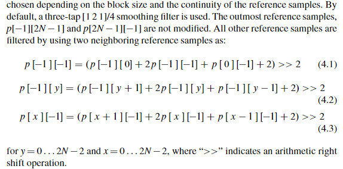

# 参考像素滤波

在补全参考像素之后，需要对参考像素进行滤波，滤波操作的主要目的是防止参考像素中的突变（英文书里是 step）使像素预测时产生预期之外的 edge，**滤波是否开启与 TU 大小和所选取的预测模式有关**，具体规则如下

1. DC 模式和 4x4 区块大小不滤波
2. 8x8 大小只有角度模式 2，18 和 34 才滤波（这三个都是斜对角）
3. 16x16 大小只有 9-11 和 25-27 才不滤波（很接近水平或者垂直的模式）
4. 32x32 大小只有 10 和 26 才不滤波（水平和垂直模式）

滤波有两种模式，分别为**默认模式**和**强滤波模式**，当 **TU 为 32x32 大小**且**参考像素变化足够平坦**且 SPS 中的 `strong_intra_smoothing_enabled_flag` 开关打开时使用强滤波，否则为默认滤波。默认滤波的滤波规则如下

滤波采用 [1 2 1]/4 滤波器，左下的 p[-1]\[2N-1] 和右上的 p[2N-1]\[-1] 点不滤波，p[-1]\[-1] 点和右边和下面的邻近点一起滤波

强滤波**只使用左上、右上和左下三个点通过线性插值计算其它所有参考点的坐标**，其规则如下

强滤波的条件（4.4 4.5）和规则（4.6 4.7）

强滤波的条件是**二阶导**小于某阈值，其具体实施方法就是一个**线性插值**

下图为两种滤波的比较

### 补充

1. 滤波不对 DC 使用的原因是滤波的 smoothing 效果对 DC 模式而言基本没有作用