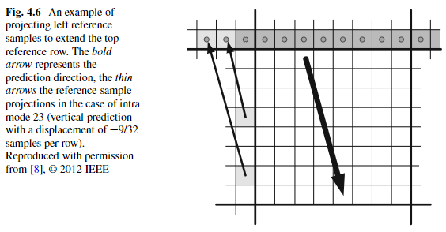

# 参考像素投影

使用参考像素预测时只使用一维的参考像素序列进行预测，因此需要采用参考像素投影将二维的参考像素变为一维，参考像素投影需要使用角度参数 A，**当 A 为正值，则直接拿上侧或左侧的一侧的参考像素作为参考像素序列，另一侧忽略**，当预测模式为 26~33 时只拿上侧，当预测模式为 2~10 时只拿左侧，**当 A 为负值，则需要拿两边的像素，根据选择的角度将另一边的像素投影至角度这边**，投影规则如下

参考像素投影规则

其中参数 B 可由角度参数 A 查表获得

参数 B 查找表

对上图例子的解释：

在上图中采用的是帧内预测模式 23，因此 \\( A=-9,\ B=-910 \\)

\\( ref[0]=p[-1][-1] \\)

当 \\( x=-1 \\) 时，\\(  ref[-1]=p[-1][-1+((-1*(-910)+128)>>8)]=p[-1][3]  \\)

当 \\( x=-2 \\) 时，\\( ref[-2]=p[-1][-1+((-2*(-910)+128)>>8)]=p[-1][6] \\)