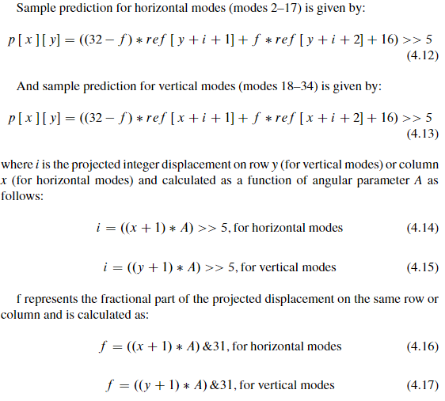

# 像素预测

在像素预测中，角度模式、DC 模式以及 Planar 模式分别有不同的预测规则

1. **角度模式**

   

   角度模式预测规则

   把待预测的像素 p[x]\[y] 投影到待预测像素序列的某个位置上（这个位置的精度为 \\( \frac{1}{32} \\)，如果 f 是 0 或者 32，那么是正好投影在某个 \\( ref[x+i+n] \\) 上，如果 f 有值，那么就是投影在 \\( ref[x+i+1] \\) 和 \\( ref[x+i+2] \\) 之间，通过这两个参考像素之间的插值确定 p[x]\[y] 的值，可以看作在 \\( ref[x+i+1] \\) 和 \\( ref[x+i+2] \\) 之间划分了 32 个区域，每个区域对应一个插值，p[x]\[y] 落在哪个区域中就用哪个区域的插值，所以说精度为 \\( \frac{1}{32} \\)）

2. **DC 模式**

   **用左侧和上方（不包括左下、左上和右上）所有参考像素的均值填充所有格**，上边缘和左边缘需要滤波

3. **Planar 模式**

   Planar 模式预测规则如下图

   

   

   

   

   Planar 模式的预测结果就是像素的垂直方向预测值 \\( p_v \\) 与像素水平方向预测值 \\( p_h \\) 的平均，垂直方向预测值就是 p[-1]\[N] 与 p[x]\[-1] 进行一个 N 个值的线性插值，每块（每个 x）一个值，p[x]\[y] 在哪块就是哪个值，水平方向预测值同理，p[-1]\[y] 与 p[N]\[-1]  进行一个 N 个值的线性插值，每块（每个 y）一个值，p[x]\[y] 在哪块就是哪个值
   
   像素预测代码见 **`TComPrediction::predIntraAng`** 函数