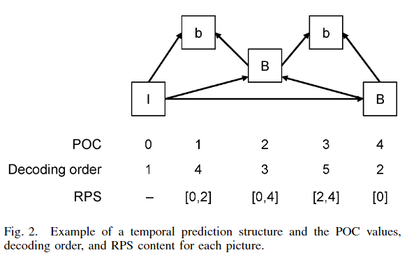

# 播放顺序与解码顺序

HEVC 解码顺序、播放顺序与参考序列的关系如下图所示

**POC**（picture order count）为**图像的实际播放顺序**，在每个 slice 的 header 传输，**RPS**（reference picture set）为**图像解码需要参考的图像集合，**由图可知**由于双向预测帧的存在，图像的解码顺序与播放顺序有时并不相同**

不存在双向预测帧时编码顺序与 POC 如图，编码顺序从上到下递增，播放顺序为 POC

存在双向参考帧时编码顺序与 POC 如图

