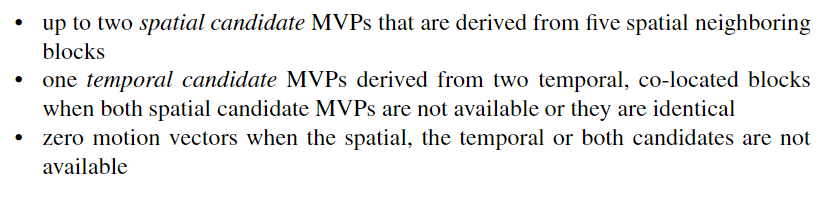

# AMVP 模式

HEVC 的 AMVP 模式相比于 Merge 模式增加了 MV 搜索的过程，**其获得的运动信息更加准确，但是也因此需要显式地对 MVD 等信息进行编码**，当 `merge_flag` 为 0 时默认启用 AMVP

AMVP 中使用的标志位和参数如下（也就是需要编码传输的运动信息？）

- `inter_pred_idc` 标志位确定是否使用参考图像序列 0 或参考图像序列 1 或者二者都使用
- `ref_idx_l0` 和 `ref_idx_l1` 标志位确定当前 PU 所选择的参考图像在参考序列中的索引，单向预测要使用一个，双向预测要使用两个
- `mvp_l0_flag` 和 `mvp_l1_flag` 标志位确定当前 PU 所选择的 MVP 在 MVP 候选序列中的索引，单向预测要使用一个，双向预测要使用两个
- MVD 相关参数

AMVP 允许**两个运动向量预测候选**，其将从**五个空域位置**和**一个时域位置**中产生，如下图，这些位置与 Merge 模式中的情况相同

(a) 图中的 Co-located block 位于**同位图片**（co-located picture）中

两个候选的构成规则如下

空域候选中五选二的规则如下

对于 A 候选的选择，首先判断 **A0 和 A1 位置的运动向量是否 available**（unavailable 的条件为该 PU 采用**帧内编码**或者该 PU **在当前 PU 所在的 slice 或 tile 之外**），然后判断 **A0 和 A1 其参考的图片是否与当前 PU 参考的图片相同**，若相同，那么**第一个发现相同的 PB 区块其 MV 将不经过 scale 操作而直接作为 MVP**（是这样吗？），如果没有相同的，那么**第一个发现不同的 PB 区块其 MV 将经过 scale 操作后作为 MVP**

对于 B 候选的选择，首先判断 **B0，B1 和 B2 位置的运动向量是否 available**，然后判断 **A0 和 A1 是否都 unavailable**，如果 A0 和 A1 都无法获取，那么**第一个参考图片与当前图片参考图片相同（也就是 non-scaled）的 B 区块的 MV 作为候选 A 的 MVP**，**第二个 non-scaled 的 B 区块或者第一个需要 scale 的 B 区块的 MV 进行 scale 操作后作为候选 B 的 MVP**，如果 A0 和 A1 里面至少有一个能获取（也就是候选 A 已经有值了），那么把**第一个 non-scaled 的 B 区块的 MV 作为 候选 B 的 MVP**，如果找不到 non-scaled 的 B 区块，**那么世界会毁灭**（图上没画。。。）

> 老师：如果b0，b1，b2的non-scale不存在的话，就用a0，a1的scale，然后再考虑b系列的scale

scale 操作公式如下

上图参数说明：

- \\( mv_{cand} \\) 是候选区块的 mv
- td 是**候选区块的参考图片**与**当前区块所在的图片**的时间距离（就是 POC 的差）
- tb 是**当前区块的参考图片**与**当前区块所在的图片**的时间距离

时域候选**从同位图片**（co-located  picture）**里选择合适的候选区块，其 MV 经过 scale 后作为 TMVP**（temporal motion vector predictor）**候选**，右下区块 **C0 被优先考虑**，中心区块 **C1 被第二考虑**，时域 Scaling 的公式同空域情况，不过 td 变为**同位图片中选择区块的参考图片与同位图片的距离**，示意图如下

HEVC 可以通过 `sps_temporal_mvp_enabled_flag` 或者 `slice_temporal_mvp_enabled_flag` 关闭 TMVP 的选用，前者是在**序列层次**，后者**需要在图片层次**，即一个图片中的所有 `slice_temporal_mvp_enabled_flag` 均需要相同，其**没有使用 pps 开头的标志位作为单个图片 TMVP 选用的开关**

同位图片的选择由 slice 类型、`collocated_from_l0_flag` 和 `collocated_ref_idx` 确定，其规则如下

每张图片上的**所有 PU 均采用同一张图片作为同位图片**（co-located picture），同位图片**在参考图片序列 0 或 1**（reference picture list 0/1）**中进行选择**，由 `collocated_ref_idx` 确定，其选择操作在片头（slice header）解码后进行，早于编码单元的解码操作

AMVP 当时域候选加上空域候选依旧小于两个时会使用**零运动向量**作为额外候选，将候选列表补充至两个候选（由于没有足够的候选进行结合产生新的额外候选，所以只能用零向量）