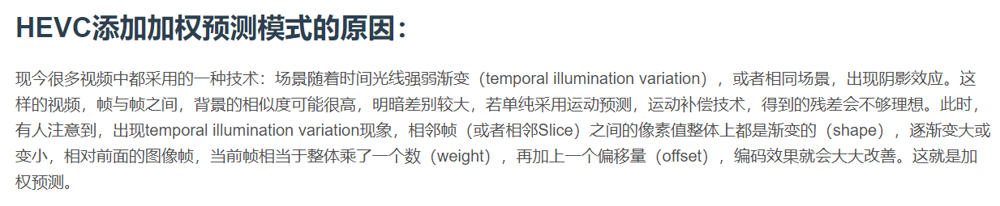

# 加权像素预测

**加权像素预测**（Weighted Prediction，WP）主要用于处理视频中**由于光线明暗变化造成的像素值的整体性的渐变**，可在 **PPS 层次**上开关控制，在 PPS 中有 `weighted_pred_flag` 参数和 `weighted_bipred_flag` 参数标记不同的情况

单向预测时 WP 操作公式如下

双向预测时 WP 操作公式如下

其中 \\( w_0,o_0,w_1,o_1 \\) **分别为参考序列 0 和参考序列 1 的权重**（weight）**和偏置**（offset），在 HEVC 中这些参数需要**显式地指定**

LWD（log weight denominator）主要用于舍入操作

### 参考资料

---

HEVC加权预测（Weight Prediction）原理兼解码代码_linpengbin的专栏-CSDN博客：[地址](https://blog.csdn.net/linpengbin/article/details/49497287)