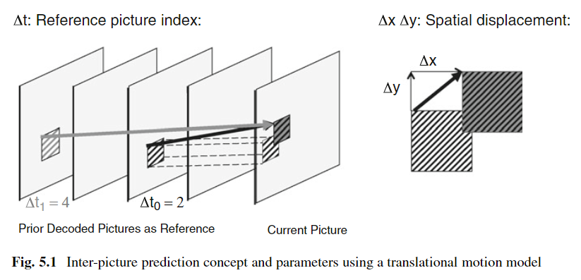

# HEVC 的帧间编码

HEVC 的帧间编码分为两个过程，一个是**运动估计**，其目的为获取**运动信息**，传输 **MVD**，一个是**运动补偿**，其目的为**获取预测图像**，传输**残差**

运动估计分为两种方法，一种是 **Merge（含 Skip）方法**，**通过空域和时域相邻区块的运动信息得到当前区块的运动信息，**另一种是 **AMVP**（Advanced Motion Vector Prediction） **方法**，其分为两个过程，一为 **MV 预测**，二为 **MV 搜索，**MV 预测**通过空域和时域相邻区块的 MV 得到当前区块的 MVP**（motion vector predictor），MV 搜索**以当前区块的 MVP 为起点搜索以获得当前区块的最优 MV，得到 MVD**（motion vector difference，MV 同样采用**预测编码**，预测值为 MVP，传输值 MVD=MV-MVP），主要的搜索算法是 **TZSearch**

运动信息（Motion Data）包含**运动向量**（Motion Vectors）和**参考图像索引**（Reference Indices），其示意图如下

\\( (\Delta x,\ \Delta y) \\) 构成运动向量，\\( \Delta t \\) 为参考图像索引，\\( (\Delta x,\Delta y,\Delta t) \\) 构成运动信息

运动补偿分为**亚精度插值**（Fractional Sample Interpolation）、**像素值预测**（Motion Compensated Predictor）和**预测结果加权**（Weighted Sample Prediction）三个部分

HEVC 帧间编码总流程的示意图如下

以 P Slice 为代表（可能也包括单向参考的 B Slice）的**单向帧间预测编码**（unipredictive coding）只有一个预测方向，**只传输一组运动信息**（MVP+MVD+RefIdx），以 B Slice 为代表的**双向帧间预测编码**（bipredictive coding）有两个预测方向，**需要传输两组运动信息。每组运动信息将产生一种像素值的预测**，对于双向预测，最后帧间预测的结果一般通过两种预测结果的**平均**产生，但是在预测结果加权中，也可能存在**两种预测结果权重不同**的现象。8x4 或者 4x8 的亮度 PB 区块只支持单向帧间预测编码
