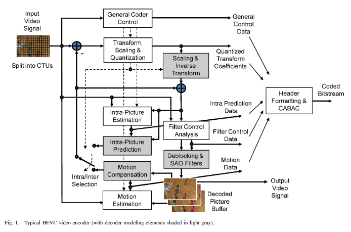

# HEVC 的基本流程

HEVC 使用**基于块的混合编码技术**，混合是指其同时使用了**预测编码**和**变换编码**的技术，预测编码指其**利用时域和空域的邻近像素预测当前像素值，之后传输实际值与预测值之差**，变换编码指其**对残差执行了 DCT 变换，传输其量化后的非零 DCT 系数**

HEVC 的具体流程为首先对图片进行**分块操作**，然后以块为单位对图片进行**帧内编码**或**帧间编码**，然后进行**帧内编码预测**或**帧间编码预测**得到图片的**第一次重建图像**（称为**预测图像**），拿图片原图减去第一次重建图像得到**残差**，将残差进行**DCT变换**、**量化**再进行**反 DCT 变换**得到**重建残差**，将第一次重建图像加上重建残差得到**第二次重建图像**，第二次重建图像进行**环路滤波**（in-loop filter）得到得到**第三次重建图像**（称为**重建图像**），第三次重建图像是最终解码的结果，将其**存入 buffer** 用作编码顺序之后帧帧间编码的参考，编码中产生的帧内/帧间编码的数据和残差（以及其它控制信号）则经过**熵编码**之后作为编码输出，之后帧的编码过程与此相同

由图可知，**HEVC 的编码器中嵌套了一个完整的解码器**